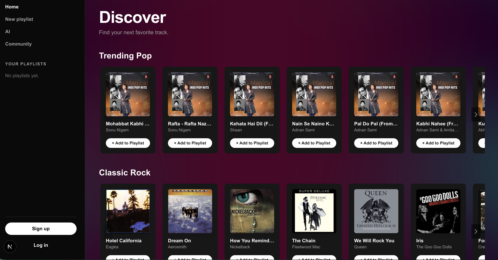
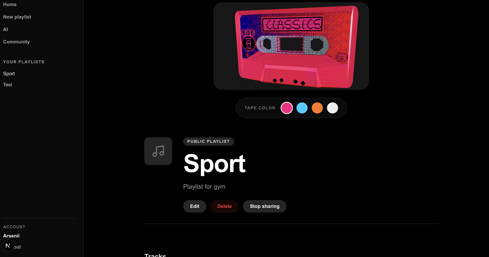
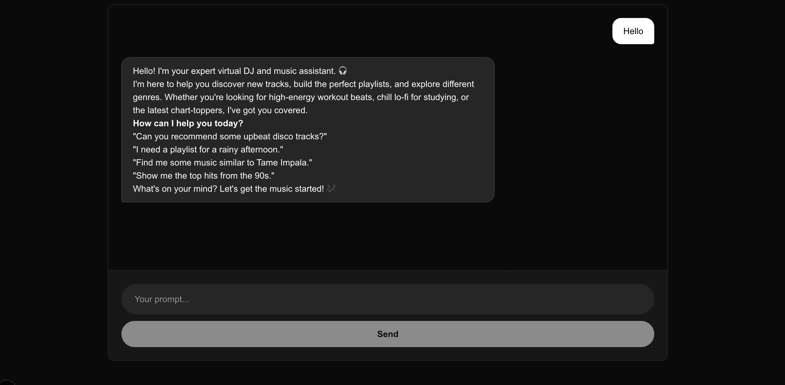

# FlyRank Frontend Capstone — Music Discovery App

This is my capstone project for the FlyRank internship. It's a full-stack music discovery and playlist app. You search for tracks using the iTunes API, preview them, build playlists, and chat with an AI assistant that can search and recommend music for you.

## Project Brief & Live Links
**Live Application:** [Music App](https://flyrank-capstone-nu.vercel.app)
**Backend API:** [Backend API](https://dashboard.render.com/web/srv-d9guu73rjlhs73d7hq00)
**Repository:** [Repo link](https://github.com/arseniygroh/flyrank-capstone)

FlyRank Music is a collaborative music discovery platform. **The problem it solves** is the isolation of solo music discovery, allowing friends to build playlists together in real-time while an AI assistant helps them find tracks they wouldn't easily discover otherwise. **It is built for** music enthusiasts, study groups, and event hosts who want a shared, interactive listening space. **I chose this idea** because it combines complex real-time WebSocket syncing with modern generative AI, posing a strong full-stack engineering challenge

## What it does

- Browse trending tracks by category (pop, rock, electronic) pulled live from the iTunes Search API
- Play 30-second previews with a persistent bottom player (play/pause, next/previous, progress bar)
- Create an account and log in (JWT-based auth)
- Create playlists, add tracks to them, edit and delete them
- Mark a playlist as Collaborative and edit it live with other users — changes made by one person show up for everyone else in the playlist in real time, over a WebSocket connection
- Share a playlist publicly to the Community page, where other users can browse it, like or dislike it, and leave comments
- Chat with an AI DJ that can search iTunes for you and recommend tracks, using tool calling
- A 3D cassette tape on playlist pages that you can recolor, which reacts when a track is playing
- A WebGL shader background running behind the hero page

## Screenshots






## Tech stack

**Frontend**
- Next.js (App Router) + React 19 + TypeScript
- Tailwind CSS
- Swiper for track carousels
- React Three Fiber + drei for the 3D cassette and shader background
- Vercel AI SDK (`ai`, `@ai-sdk/react`) for the chat interface and tool calling
- Framer Motion for the stateful button and other animations

**Backend**
- Express (Node.js)
- Socket.IO for real-time collaborative playlist editing
- JWT for authentication, bcrypt for password hashing
- JSON files as the data store (see "Known limitations" below)

**Testing / CI**
- Vitest for component tests
- Playwright for end-to-end tests
- GitHub Actions for CI

**Deployment**
- Frontend: Vercel
- Backend: Render

## Architecture overview

The frontend and backend are two separate apps that talk to each other over HTTP.

```
┌───────────────────────┐   HTTP + WebSocket    ┌──────────────────────┐
│   Next.js frontend    │ ───────────────────►  │   Express backend    │
│   (Vercel)            │ ◄───────────────────  │   (Render)           │
│                       │                       │                      │
│   - pages/routes      │                       │   - /register, /login│
│   - React contexts    │                       │   - /playlists CRUD  │
│     (Auth, Playlists) │                       │   - /playlists/share,│
│   - /api/chat route   │                       │     comments, ratings│
│     (talks to Gemini) │                       │   - Socket.IO server │
│                       │                       │ - JWT auth middleware│
│                       │                       │   - JSON file storage│
└──────────┬────────────┘                       └───────────┬──────────┘
           │                                                  │
           ▼                                                  ▼
   iTunes Search API                                  data/users.json
   (public, no key needed)                            data/playlists.json
```

**Auth flow:** on login, the backend signs a JWT and sends it back with an expiration timestamp. The frontend stores it in `localStorage`, sends it as a `Bearer` token on every playlist request, and schedules a local timer to auto-log-out the user right when the token expires, backed up by checking for `401` responses on every API call.

**Collaborative editing flow:** when a playlist's privacy is set to Collaborative, opening it joins a Socket.IO room keyed by the playlist's ID (`socket.join(playlistId)`). Any edit one user makes is broadcast to that room (`send_playlist_update`), and everyone else currently viewing that playlist receives it live (`receive_playlist_update`) without needing to refresh.

**Community flow:** a playlist owner can mark a playlist as shared, which makes it visible on `/playlists/share` to anyone (not just logged-in users, for browsing) as long as it isn't set to Private. From there, other logged-in users can like, dislike, or comment on it. Likes and dislikes are tracked per user ID so a user's vote toggles rather than stacking, and a user can only delete their own comments.

**Chat flow:** the chat page uses `useChat` from `@ai-sdk/react`, which streams responses from a Next.js API route (`/api/chat`). That route calls Gemini via the Vercel AI SDK and gives it one tool, `searchItunes`, which it can call to look up real tracks and show them inline in the chat.

**3D cassette:** lazy-loaded with `next/dynamic` (`ssr: false`) so the Three.js bundle and WebGL canvas don't block the initial page load. The GLTF model was compressed with Draco via `gltfjsx --transform`, bringing it down to about 31KB.

## Run it locally

You need two terminal windows — one for the backend, one for the frontend.

### Backend

```bash
cd backend
npm install
```

Create a `.env` file in the backend folder:

```
JWT_SECRET=some-long-random-string-you-generate-yourself
FRONTEND_URL=http://localhost:3000
PORT=5000
```

Generate a real `JWT_SECRET` with:
```bash
node -e "console.log(require('crypto').randomBytes(64).toString('hex'))"
```

Then start it:
```bash
node server.js
```

### Frontend
in main project folder run:
```bash
npm install
```

Create a `.env.local` file in the frontend folder (see the env var table below), then:
```bash
npm run dev
```

Visit `http://localhost:3000`.

### Running tests

```bash
npx vitest run          # component tests
npx playwright test     # end-to-end tests
```

## Environment variables

### Backend (`.env`)

| Variable | Required | Description |
|---|---|---|
| `JWT_SECRET` | Yes | Random secret used to sign and verify auth tokens. Never commit this. |
| `FRONTEND_URL` | Yes | The frontend's URL, used for CORS. Locally this is `http://localhost:3000`. |
| `PORT` | No | Port the server listens on. Defaults to 5000 locally. Render sets this automatically in production. |

### Frontend (`.env.local`)

| Variable | Required | Description |
|---|---|---|
| `NEXT_PUBLIC_API_URL` | Yes | URL of the backend API. Locally, `http://localhost:5000`. |
| `GOOGLE_GENERATIVE_AI_API_KEY` | Yes | API key from Google AI Studio, used by the chat feature. |
| `GEMINI_MODEL` | No | Overrides the Gemini model name without a code change, in case a model gets deprecated (this has already happened once during development). |

## Decisions and trade-offs

- **JSON files instead of a real database.** For a capstone timeline this was faster to get working end to end. It's a known weak point: concurrent writes to the same file can overwrite each other, and Render's filesystem isn't guaranteed to persist across redeploys. If I kept working on this, moving to Postgres would be the first infrastructure change I'd make.
- **JWT in localStorage instead of an httpOnly cookie.** Simpler to wire up for a project this size, but it means the token is technically readable by any script running on the page (XSS risk). A cookie-based approach is more defensible for anything handling real user data.
- **Gemini for the chat feature.** Gemini has a usable free tier, which matters for a student project with no budget. The AI SDK abstracts the provider behind one `chatModel` object, so swapping to a different provider later would be a small, contained change rather than a rewrite of the chat feature.
- **Two separate deployments (Vercel + Render) instead of one.** Next.js API routes could have hosted the backend too, but keeping Express as a standalone service meant not having to rewrite existing backend code, at the cost of an extra deployment to manage and a CORS setup to maintain between them.
- **Socket.IO rooms keyed by playlist ID for collaboration**, rather than one global socket namespace. This keeps updates scoped to only the users actually viewing a given playlist, instead of broadcasting every edit to every connected client.
- **Public playlist browsing (`/playlists/share`, `/playlists/:id`) has no auth requirement**, unlike the rest of the API. This was intentional, since the community page is meant to be browsable, but it does mean anyone with a playlist's ID can view it once it's shared and not private.

## Known limitations

- Playlist and user data is stored in flat JSON files with no locking, so simultaneous writes can lose data. This applies to comments and likes too, not just playlist edits — not something I'd want in a real product.
- No rate limiting on login/register yet, so brute-forcing passwords isn't currently blocked server-side.
- The free tier of Render spins the backend down after inactivity, so the first request after idle time can take 30-50 seconds while it wakes up.
- Socket.IO events currently trust whatever `playlistId` a client sends when joining a room, without checking that the user actually has permission to be in that collaborative session.
- Deleted or missing users aren't fully handled everywhere — a playlist whose creator account no longer exists can cause a lookup to fail on some routes.

---

## Interactive 3D Experience: Dynamic Cassette Tape

As part of the 3D-on-the-web integration, the playlist detail view features an interactive 3D cassette tape that serves as dynamic, customizable cover art.

- **What was built:** A 3D scene rendering a customizable cassette tape using React Three Fiber (`@react-three/fiber` and `@react-three/drei`). The scene includes a material configurator allowing users to change the tape's plastic shell color (e.g., Neon Pink, Matte Black). It is deeply integrated with the app's global audio state: when a track is actively playing, the cassette responds by triggering a gentle floating/bobbing animation.
- **Performance note (optimization and loading):** To maintain strict performance budgets and ensure usability on mobile devices, the original GLTF model was optimized using the `gltfjsx --transform` pipeline. This applied Draco compression, drastically shrinking the geometry footprint to just ~31KB. The heavy WebGL `<Canvas>` and Three.js library are lazy-loaded via Next.js `next/dynamic` (`ssr: false`) with a lightweight static CSS skeleton as a fallback, so the 3D assets don't block the main thread or slow down initial page load.
- **What I'd add with more time:**
  - **Audio-reactive physics:** hooking the 3D scene into the Web Audio API so the cassette pulses or vibrates in sync with the bass frequencies of the active track.
  - **Dynamic texture mapping:** generating a 2D HTML Canvas element with the playlist's title and applying it as a texture onto the cassette's paper label, instead of raw 3D geometry text.
  - **Drag-to-spin momentum:** physics-based rotational momentum so users can flick and spin the cassette with their cursor or touch screen.

## AI Tool Contract: `searchItunes`

- **Name:** `searchItunes`
- **Description:** Search the iTunes API for music tracks.
- **Input schema (Zod):**
  ```typescript
  {
    query: string // The search term
  }
  ```
- **Return shape:** an array of mapped track objects, or an error object:
  ```typescript
  Array<{
    trackId: number,
    title: string,
    artist: string,
    coverArt: string
  }> | { error: string }
  ```

## Stateful Button Interaction Design

The `StatefulButton` component manages a 5-step lifecycle (idle, hover/focus, loading, success, error) with intentional motion logic:

- **Compositor-only animations:** the inner content transitions use only `opacity`, `scale`, and `y` transforms inside an `AnimatePresence` (`mode="wait"`) block, so the browser only repaints instead of triggering layout recalculations.
- **Easings and durations:**
  - Content swaps (idle to loading) use a quick `0.2s` duration to stay responsive.
  - The success checkmark uses a spring transition (`stiffness: 300`, `damping: 20`).
  - The error shake uses a custom keyframe array `[0, -8, 8, -6, 6, 0]` over `0.4s`.
- **Accessibility:** the shake animation is wrapped in a `useReducedMotion` check. If a user prefers reduced motion, the shake is disabled, but the red color and "Failed" text swap still happen — feedback is never removed, only the motion is.

## How AI tools built this

I used Claude and Gemini throughout this project as a pair programmer, mainly for code review, debugging, and unblocking myself on infrastructure I hadn't set up before. Being honest about what that actually looked like:

- **Debugging real errors, iteratively.** A lot of this project involved pasting actual error messages and stack traces and working through them one at a time — CORS failures, a missing `dotenv` call that made an environment variable check throw and silently break CORS for every origin, a malformed GitHub Actions YAML file where one misplaced space made GitHub stop recognizing the workflow entirely, and API version mismatches after upgrading the Vercel AI SDK, where the shape of `tool()` and `useChat()` had changed between versions.
- **Explaining unfamiliar territory.** Things like how `position: fixed` behaves relative to a transformed ancestor, why `npm ci` is stricter than `npm install`, and how GitHub Actions minutes/concurrency limits work were all explained rather than just fixed for me, so I understood the underlying reason and not just the patch. Also, AI helped me with Next.js integration and deployment in production using Vercel for frontend and Render for backend.
- **3D experince and Shaders.** AI helped structure the initial GLSL fragment shader logic and the React Three Fiber `useFrame` loops, allowing me to focus on mathematically remixing the outputs and optimizing the model loading pipeline. Also, it helped me with 3D casette rendering which starts moving a song is being played and it is configurable, you can choose a color for you cassete.

## Reflection

**What was hardest?** Syncing the real-time WebSocket events (socket.io) with React's strict state lifecycle. Ensuring that a playlist update broadcasted by User A didn't overwrite a concurrent edit by User B required careful state merging and event handling. Also, making 3D experience and Shaders which requires strong foundation in `Three.js` library.
**One thing I learned that surprised me:** I was surprised by how much heavy lifting standard WebGL and Three.js can do on the GPU without impacting the main thread, provided you optimize the models correctly and manage React renders properly.
